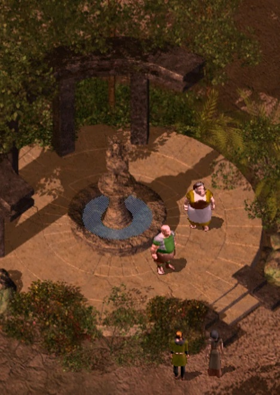

<html>

<b>Imnesvale Invasion</b>

<b>Tactical quest mod for BG2EE and EET</b>

Original mod by Duality  
A bhaalspawn and his followers invade Imnesvale - another bhaalspawn and companions must stop them.

- This mod adds some difficult encounter to Imnesvale after Underdark - provided you defeated the shadow lord before. 
- Protect Minister Lloyd and his wife.
- Make use of Madulf or other allies you have made before.

  
  

 
&nbsp;

&nbsp;

</body>

</html>

